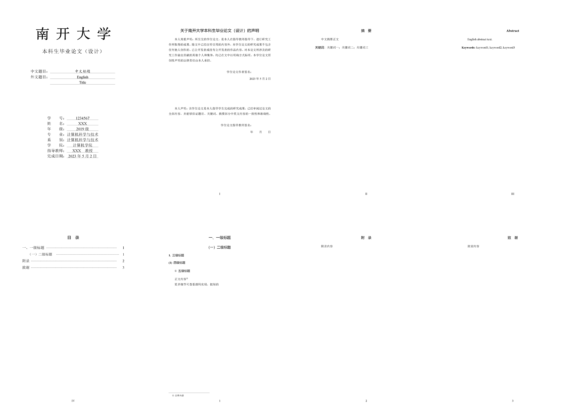

# LaTeX模板：南开大学本科生毕业论文

根据[2022年11月版《南开大学本科毕业论文（设计）指导手册》](http://jwc.nankai.edu.cn/2022/1124/c24a497818/page.htm)的格式要求，基于`ctexart`文档类，编写`nkuthesis-ug`文档类，含封面，兼容页眉。

模板整理自作者自己的论文，**作者自己论文的格式尚未审核，模板仅供参考，请自行校对**。如有任何问题可联系作者或留言。

## 预览

## 相关链接：
- https://article.benhaotang.cn/pc/26.html
- https://github.com/skyline77/NKU-biyelunwen-2021
- https://github.com/Tr0py/NKU-thesis-template-2020
- https://zhuanlan.zhihu.com/p/74515148
- https://zhuanlan.zhihu.com/p/51494365